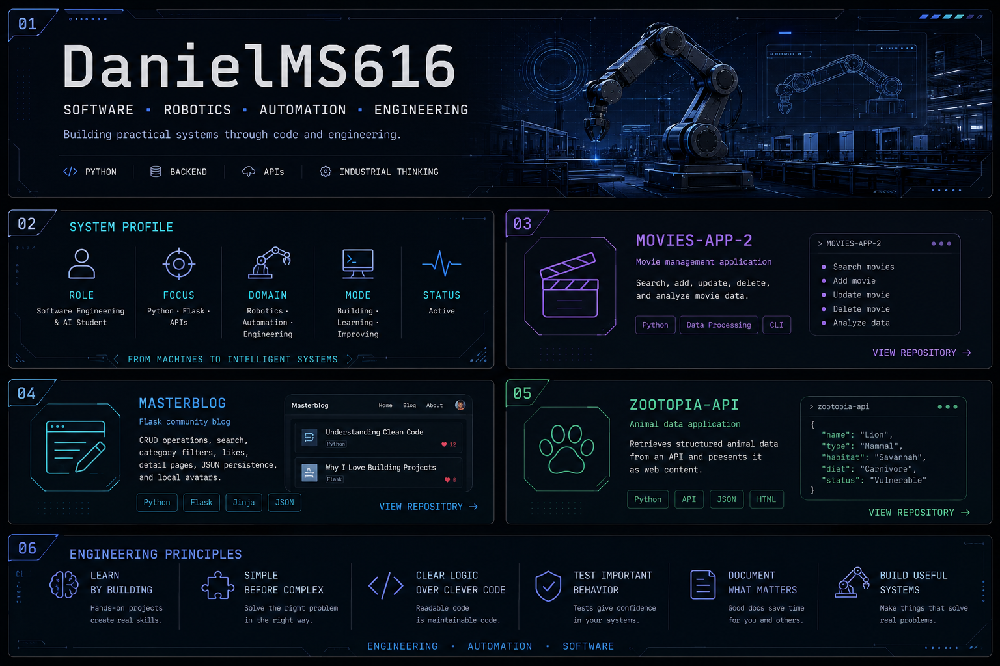

  

  <a href="https://github.com/DanielMS616/Movies-App-2">Movies-App-2</a>
  &nbsp;·&nbsp;
  <a href="https://github.com/DanielMS616/Masterblog">Masterblog</a>
  &nbsp;·&nbsp;
  <a href="https://github.com/DanielMS616/zootopia-api">zootopia-api</a>

  Python · Flask · APIs · Robotics · Automation · Engineering

  <a href="https://github.com/DanielMS616">GitHub</a>
  &nbsp;·&nbsp;
  <a href="www.linkedin.com/in/daniel-glöde-a319ba418">LinkedIn</a>
  &nbsp;·&nbsp;
  <a href="https://github.com/DanielMS616?tab=repositories">Repositories</a>

